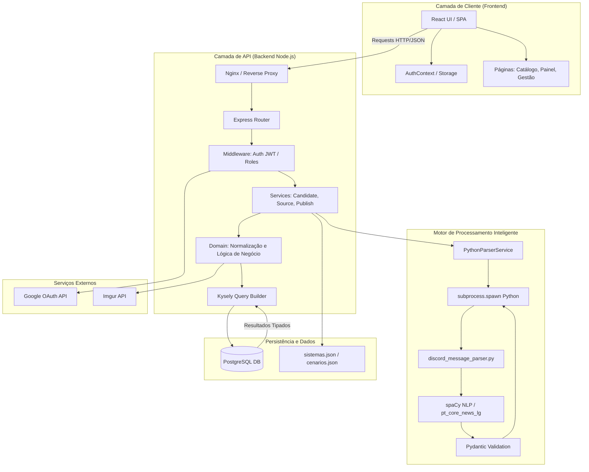

Esta é a **Documentação Técnica e de Arquitetura Oficial** do sistema **Anúncios de Mesas RPG — Artifício RPG**, consolidada a partir da análise integral do código-fonte e documentos de governança.

---

# 1. Proposta e Visão Geral

### Objetivo Principal
O **Anúncios de Mesas RPG** é uma plataforma fullstack projetada para centralizar a descoberta e publicação de mesas de RPG de mesa no Brasil. A proposta de valor foca em **autonomia para mestres**, **facilidade de busca para jogadores** e um **pipeline de automação** que ingere anúncios brutos de redes sociais (inicialmente Discord), processando-os via Inteligência Artificial para transformá-los em dados estruturados.

### Stack Tecnológico
| Camada | Tecnologia |
| :--- | :--- |
| **Frontend** | React 19, TypeScript, Vite, Tailwind CSS, Lucide React. |
| **Backend** | Node.js (Runtime), Express (Framework API), TypeScript. |
| **Persistência** | PostgreSQL 16+, Kysely (Query Builder Type-safe). |
| **Processamento IA** | Python 3, spaCy (NLP), Pydantic (Validação), Dateparser. |
| **Infraestrutura** | Docker & Docker Compose, Nginx (Proxy Reverso), GitHub Actions (CI/CD). |
| **Integrações** | Google OAuth 2.0 (Auth), Imgur API (Imagens). |

---

# 2. Configuração e Variáveis de Ambiente

O sistema utiliza arquivos `.env` para gerenciar segredos e configurações específicas de ambiente (Local, Beta, Produção).

### Principais Variáveis de Ambiente
| Variável | Finalidade |
| :--- | :--- |
| `DATABASE_URL` | String de conexão com o PostgreSQL (user, pass, host, port, db). |
| `JWT_SECRET` | Chave privada para assinatura dos tokens de sessão. |
| `JWT_EXPIRES_IN` | Tempo de expiração do token (configurado como `7d`). |
| `GOOGLE_CLIENT_ID` / `SECRET` | Credenciais do Google Cloud Console para o OAuth 2.0. |
| `GOOGLE_CALLBACK_URL` | Rota de retorno do OAuth (ex: `/api/v1/auth/google/callback`). |
| `IMGUR_CLIENT_ID` | Identificador para upload anônimo de imagens no Imgur. |
| `PYTHON_CMD` | Comando para invocar o interpretador (ex: `python3` no Linux, `python` no Win). |
| `VITE_API_URL` | (Frontend) URL base da API para as requisições do cliente. |

### Scripts de Inicialização
*   **Backend:** `npm run dev` (desenvolvimento), `npm run build` (compilação TS), `npm run start` (produção).
*   **Frontend:** `npm run dev` (Vite dev server), `npm run build` (geração de assets estáticos).
*   **Importadores:** `npm run systems:import-tree` (popula taxonomia), `npm run aggregator:import` (processa JSON do Discord).

---

# 3. O Mapa da Arquitetura (Topologia Detalhada)

O diagrama abaixo descreve o fluxo de dados desde a interação do usuário até o processamento de linguagem natural e persistência.

---

# 4. Documentação de API e Integrações

### Rotas de API (Prefixadas com `/api/v1`)

| Método | Endpoint | Propósito | Autenticação |
| :--- | :--- | :--- | :--- |
| **GET** | `/auth/google` | Inicia fluxo de login social. | Pública |
| **GET** | `/me` | Retorna dados do usuário logado e perfil. | JWT (Qualquer) |
| **GET** | `/tables` | Catálogo público com filtros avançados. | Pública |
| **POST** | `/gm/profile` | Cria perfil de mestre (eleva role player -> gm). | JWT (Player) |
| **POST** | `/gm/tables` | Publica uma nova mesa manualmente. | JWT (GM) |
| **GET** | `/aggregator/sources` | Lista fontes de anúncios (Discord). | JWT (Admin) |
| **POST** | `/aggregator/import/file` | Ingestão de JSON exportado do Discord. | JWT (Admin) |
| **GET** | `/aggregator/candidates` | Fila editorial de anúncios para revisão. | JWT (Admin) |
| **PATCH** | `/aggregator/candidates/:id/accept` | Aprova anúncio IA e o converte em mesa ativa. | JWT (Admin) |
| **POST** | `/admin/systems` | Criação manual de novos sistemas na taxonomia. | JWT (Admin) |
| **DELETE** | `/admin/tables/:id` | Deleção administrativa de mesas. | JWT (Admin) |

### Integrações Externas
1.  **Google OAuth:** O sistema delega a identidade para o Google. No callback, o backend extrai `id`, `email` e `picture`, realizando um *upsert* na tabela `users`.
2.  **Imgur API:** Utilizada para hospedagem de imagens de capa e avatares. O backend processa a imagem (Sharp), converte para WebP e envia via `Client-ID` restrito.
3.  **Python Subprocess:** O Node.js atua como orquestrador, enviando o texto da mensagem via CLI para o script Python e capturando o `stdout` contendo o JSON processado.

---

# 5. Funções Core e Lógica de Negócio

### 5.1 Parsing Inteligente (Node.js + Python)
O diferencial tecnológico do projeto é o `pythonParserService.ts`. 
*   **Comunicação:** Utiliza `child_process.spawn` com a variável `PYTHONUNBUFFERED=1` para garantir que o Node capture a saída do spaCy sem atrasos.
*   **Enriquecimento:** O script Python (`discord_message_parser.py`) utiliza o modelo `pt_core_news_lg` para identificar entidades e padrões. 
*   **Lógica de Campos:** Se o Python extrair `enrichedFields`, o backend os prioriza. Caso contrário, o frontend possui um `fallback` via `parseDiscordContent.ts` (baseado em Regex).
*   **Reparo Automático:** A função `repairTruncatedJson` no backend corrige exports incompletos do DiscordChatExporter, fechando chaves e colchetes ausentes antes do processamento.

### 5.2 Fluxo de Persistência com Kysely
O projeto abandona ORMs pesados em favor do Kysely para garantir "TypeScript ao máximo".
*   **Tipagem:** A interface `Database` em `backend/src/db/types.ts` mapeia todas as colunas, incluindo enums como `user_role` e `table_status`.
*   **Atomicidade:** Operações complexas (como aceitar um candidato e criar a mesa + contatos) são executadas dentro de `db.transaction().execute()`, garantindo que não existam mesas sem informações de contato.

### 5.3 Regras Editoriais e Selos
*   **DDAL:** O selo de *Adventurers League* só é permitido se o `system_id` apontar para o caminho hierárquico `dungeons-dragons/5e/2024`.
*   **Covil do Lich:** Identificado automaticamente pelo parser se termos como "Covil" ou "Lich" aparecerem no título ou sinopse.

---

# 6. Status Atual: O que já tem vs. O que falta

### O que já está implementado (Pronto)
*   ✅ **Auth System:** Google OAuth completo com JWT de 7 dias e proteção de rotas.
*   ✅ **Gestão de Taxonomia:** Árvore hierárquica de sistemas (Sistema > Edição > Variante) e suporte a cenários com subgêneros.
*   ✅ **Dashboard do Mestre:** Criação de mesas com frequência customizada, regras e suporte a selos.
*   ✅ **Aggregator Pipeline:** Ingestão de JSON, normalização de mensagens e fila de candidatos.
*   ✅ **IA Parser (Fase B):** Extração avançada de múltiplos horários, vagas detalhadas e classificação automática de pagamento (paga/gratuita).
*   ✅ **UX Nielsen:** Implementação de Toasts (react-hot-toast), spinners de carregamento e confirmações de segurança.
*   ✅ **Admin CRUD:** Interface completa para gerenciar sistemas e cenários sem psql manual.

### Débito Técnico e Backlog (Prioridades)
*   ❌ **Expiração Real:** A Migration 10 (retenção) precisa de um `CleanupWorker` no Node para deletar fisicamente mesas expiradas do banco.
*   ❌ **Imagens Automáticas:** O pipeline Imgur + Sharp para processamento de arquivos enviados via formulário (`REQ-03`) ainda é manual/parcial.
*   ❌ **Soft Delete:** A deleção de mesas é *hard delete*. Implementar *soft delete* (`deleted_at`) para auditoria futura.
*   ❌ **Módulo Social:** Perguntas, respostas e avaliações de mesas (`REQ-27` a `REQ-30`) ainda são placeholders no catálogo.
*   ❌ **Performance:** Migrar a busca Fuse.js do frontend para uma busca `tsvector` no PostgreSQL se o catálogo ultrapassar 10.000 registros.

---
**Documentação encerrada.** Este sistema encontra-se em estágio avançado de Beta funcional.